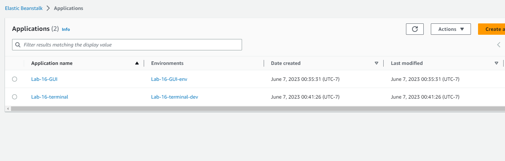

# Cloud-Server

Lab 16 AWS

## Task 1

Create a new environment, using Elastic Beanstalk from the AWS Control Panel (GUI)
Manually deploy your application to this environment by uploading a .zip file

[Control Panel Deploy Link](Lab-16-GUI-env.eba-mupzsw5t.us-west-2.elasticbeanstalk.com )

## Task 2

Using the same server, create a new environment using Elastic Beanstalk from your terminal
Manually deploy your application to this environment by using eb deploy

[Terminal Deploy Link](Lab-16-terminal-dev.us-west-2.elasticbeanstalk.com)

### Notes

- Had some issues with installing aws cli.
- One of the deploys health indicator was ok now has turned to warning...  

 
